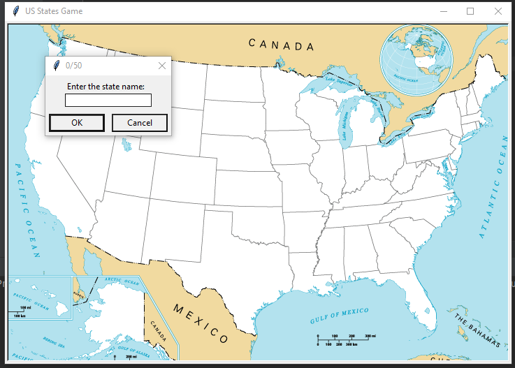

# US-States-game
In this game we have to guess the different states of United states of America and it also keeps the score of the states we have guessed correctly and also the correct guessed state will be placed in their respective position. It will help the students in learnig the different states of different country in fun and easy way. After finishing the guesses it will provide a text file which contains the name of the states we have not guesses correctly. This game helps us in remembering the states of United States and also increase our knowledge in Geographics of the World. It is a fun game to learn geography of country and can also be played as competition, in which ask who will guess most correct states in certain time or who will guess all states correctly in least time period.

## Technologies
- Python
- Tkinter
- Pandas

## Preview

**This how the game looks.**
